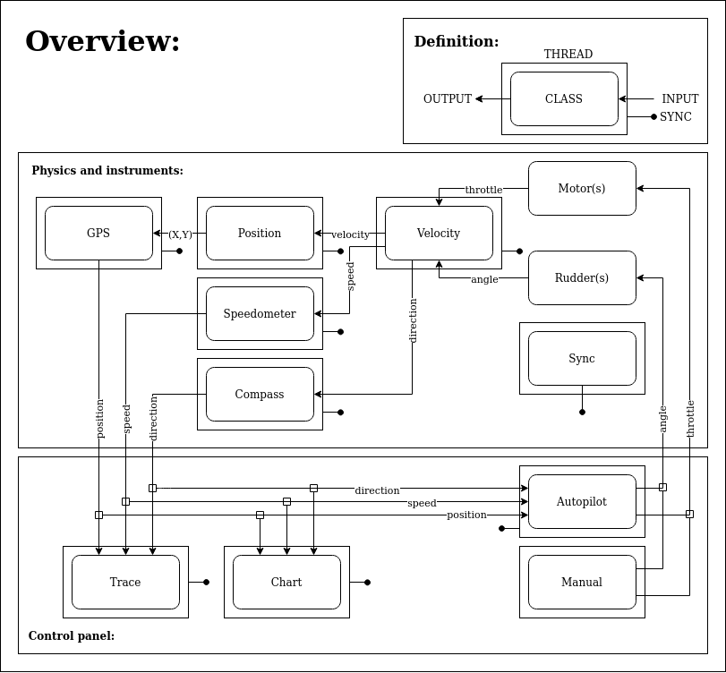

# Ship Simulator:
##About

## Physics and Instruments:
Contains the barebone of the simulator. Interaction with the modules
is made easy with 3 outputs to get the state of the simulation. To change
the state, two inputs are used. The I/Os are:
*Output: Position, Speed and direction.
*Input: Angle and throttle.
(For more details, check the Wiki.)

## Control panel:
Contains the user interactions with the simulation together with some additional
services. Controls and states of the simulation are displayed in a GUI.
Additional services are the database and Autopilot.
(For more details, chck the Wiki.)

## Block Diagram:

